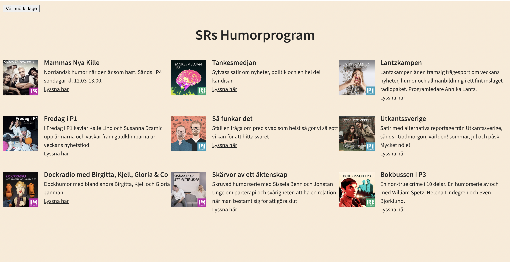

# Sveriges Radio:s Humorprogram

Inlämningsuppgift i kursen "Arbetsmetodik för utvecklare" på Medieinstitutet.

## Om projektet

Det här är en webbsida för Sveriges Radio som presenterar dess humorprogram med ett fetch API. Uppgiften gick ut på att man ska visa sina kunskaper om hur man kan förbättra den redan befintliga koden, samt att visa kunskaper om hur man använder Git på ett korrekt sätt. Med hjälp av "Att göra listan" skapades det issues och även nya branches för att få kontoll och en överblick av projektet.

## Att göra lista

### G

- [x] Få projektet att funka
- [x] CSS till Sass
- [x] Enhetlig namngivning i CSS:en
- [x] Konvertera till TypeScript
- [x] Enhetlig kodkvalitet
- [x] Mobilvyn
- [x] Språk
- [x] Rensa loggning
- [x] Dokumentation
- [x] Tillgänglighet (bilder)
- [x] Refaktorera funktioner
- [x] Eliminera onödig kod
- [x] Rensa bort kod som inte ska sättas

### VG

- [ ] Rätt sak på rätt plats
- [ ] Hantera loggning på ett effektivt sätt
- [ ] Gör en tillgänglighetsgranskning av sidan
- [ ] Utnyttja features i Sass i CSS:en
- [ ] Rensa bort paket som inte används
- [ ] Hantera fel i API-anropet
- [ ] Gör en Lighthouse-analys
- [ ] Läs av utvecklingsmiljön
- [ ] Enhetlig syntax i CSS:en
- [ ] Publicera sidan på GitHub pages

## Använts i projektet

- GitHub
- TypeScript
- HTML
- SCSS/CSS
- ESlint
- Prettier
- Vite

## Kom igång

1.  Klona ned det här repot och öppna i ett utvecklingsverktyg.

        git clone https://github.com/Medieinstitutet/inlamningsuppgift-1-Malinaahlin.git

2.  Installera

    npm install

3.  Starta i terminalen

    npm run dev

## Mer om mig

MALIN ÅHLIN

- [LinkedIn](https://www.linkedin.com/in/malin-aahlin/)
- [Github](https://github.com/Malinaahlin)
